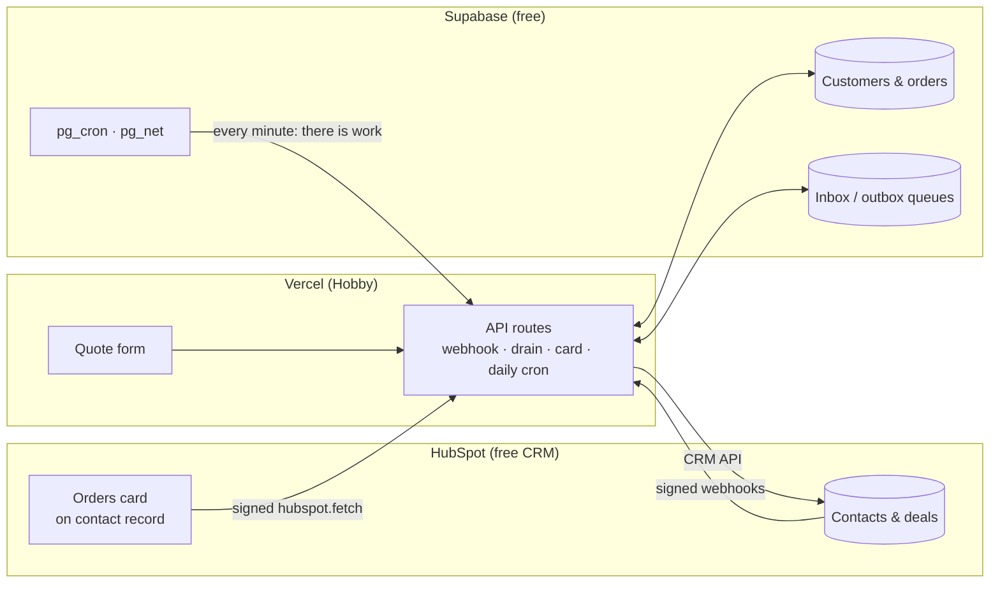

# Fernhill Order Sync — HubSpot ↔ Supabase integration demo

A working portfolio integration: **a custom database and a custom front-end connected to HubSpot CRM**,
built entirely on free tiers (no paid plan, no credit card).

> **Fernhill Supply Co. is a fictional company.** All data is synthetic: generated names,
> `@example.com` emails and seeded orders. The sync refuses to store anything else.

[](../../actions/workflows/ci.yml)
[](../../actions/workflows/secret-scan.yml)

## What it shows

| | |
|---|---|
| **Orders inside HubSpot** | A custom card on every contact record lists that contact's orders from the external database, newest first. |
| **Two-way sync** | Edit a contact in HubSpot and the database updates in seconds. Add an order in the database and the contact's totals (order count, lifetime value, last order date) update in HubSpot. |
| **A custom front-end** | A public quote form creates (or reuses) the HubSpot contact and creates an associated deal. Submitting twice never creates duplicates. |
| **Visible operations** | A public activity page shows every sync event, including webhooks the integration deliberately ignored to prevent loops. |

Live demo: **https://fernhill-order-sync.vercel.app** (form) · **/activity** (sync log)

## How it works



- **HubSpot → database.** Webhooks are signature-checked (v3), queued, and processed after a 204 reply.
  The worker always fetches the contact's current state instead of trusting the event, so duplicate or
  out-of-order webhooks can't corrupt data.
- **Database → HubSpot.** Database triggers queue work in the same transaction as the change; a per-minute
  signal makes Vercel drain the queue. Failures retry with backoff and are parked (visible) after 8 attempts.
- **No sync loops.** Each field has one owner (HubSpot owns identity fields, the database owns orders), the
  integration recognises its own writes when they echo back as webhooks, and roll-up properties are never
  subscribed to.
- **Idempotent by design.** Webhook events, queue jobs and form submissions are all de-duplicated, and every
  step can be retried safely.
- **Self-healing.** A daily job re-checks recently changed contacts and confirms every linked contact still
  exists, catching anything a missed webhook would have lost.

Full design: [docs/PRD.md](docs/PRD.md) (requirements) and [docs/ARCHITECTURE.md](docs/ARCHITECTURE.md) (design).

## Stays free

| Platform | Plan | What it provides here |
|---|---|---|
| HubSpot | Free CRM + developer platform | Static-token app, app card, webhooks, CRM API |
| Supabase | Free | Postgres, `pg_cron`, `pg_net`, Vault |
| Vercel | Hobby | Next.js hosting, API routes, daily cron |

Paid-only features were designed out: no HubSpot custom objects (the card shows orders instead), no
HubSpot-hosted serverless functions (the card calls Vercel), no sub-daily Vercel cron (Supabase `pg_cron` drives retries).

## Repository layout

```
hubspot/    HubSpot project: app config, orders card (React), webhook subscriptions
web/        Next.js app on Vercel: form, activity page, API routes, sync workers
supabase/   SQL migrations and database behaviour tests
scripts/    Setup and operations: migrations, HubSpot properties, Vercel env, Vault, demo reset
docs/       Requirements, architecture, demo script
```

## Running it yourself

You need Node 22, Docker, the HubSpot CLI (`npm i -g @hubspot/cli`), the Vercel CLI (`npm i -g vercel`),
and free accounts on HubSpot, Supabase and Vercel.

1. **Supabase.** Create a free project. Copy `.env.example` to `.env.local` and fill in `SUPABASE_DB_URL`
   (Connect → Session pooler) and `SUPABASE_SECRET_KEY`. Then apply the schema:
   `bash scripts/migrate.sh`
2. **HubSpot.** `hs account auth`, then from `hubspot/`: `hs project upload`. Install the app
   (project → app → Distribution → Install), and fill in `HUBSPOT_TOKEN`, `HUBSPOT_CLIENT_SECRET`,
   `HUBSPOT_APP_ID` and `HUBSPOT_PORTAL_ID`. Create the custom properties:
   `node scripts/setup-hubspot-properties.mjs`
3. **Vercel.** From `web/`: `vercel link`, then `node ../scripts/push-vercel-env.mjs` (generates the
   internal secrets) and `vercel deploy --prod`. If your domain differs from `fernhill-order-sync.vercel.app`,
   update it in `hubspot/src/app/app-hsmeta.json`, `webhooks/webhooks-hsmeta.json` and `cards/OrdersCard.tsx`.
4. **Connect the queue signal.** `bash scripts/set-vault-secrets.sh https://<your-domain>/api/drain`
5. **Seed demo data.** `node scripts/demo-reset.mjs --yes`
6. In HubSpot, add the **Orders (Fernhill demo)** card to the contact record (Settings → Objects →
   Contacts → Record customization).

> **Windows:** if your path contains `&`, `.cmd` shims such as `hs`, `npx` and `npm run` scripts can fail.
> The npm scripts here call `node` directly; run CLIs the same way, for example
> `node "%APPDATA%\npm\node_modules\@hubspot\cli\bin\hs.js" project upload`.

## Tests

```bash
cd web && npm test && npm run typecheck   # 51 unit tests: signatures, HubSpot client, sync, form, daily job, route auth
bash supabase/tests/run.sh                # 71 database checks against Supabase's Postgres image (Docker)
```

CI runs both on every push. Secrets are blocked by a gitleaks pre-commit hook
(`git config core.hooksPath scripts/hooks`) and a gitleaks scan in CI.

## Operations

| Task | Command |
|---|---|
| Apply new migrations | `bash scripts/migrate.sh` (`--status` to preview) |
| Reset the demo to its seed state | `node scripts/demo-reset.mjs --yes` |
| Update the HubSpot app or card | from `hubspot/`: `hs project upload` |
| Watch sync activity | `/activity` on the deployed site |

## License

[MIT](LICENSE)
