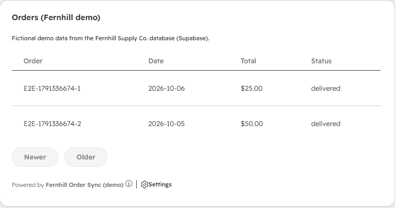
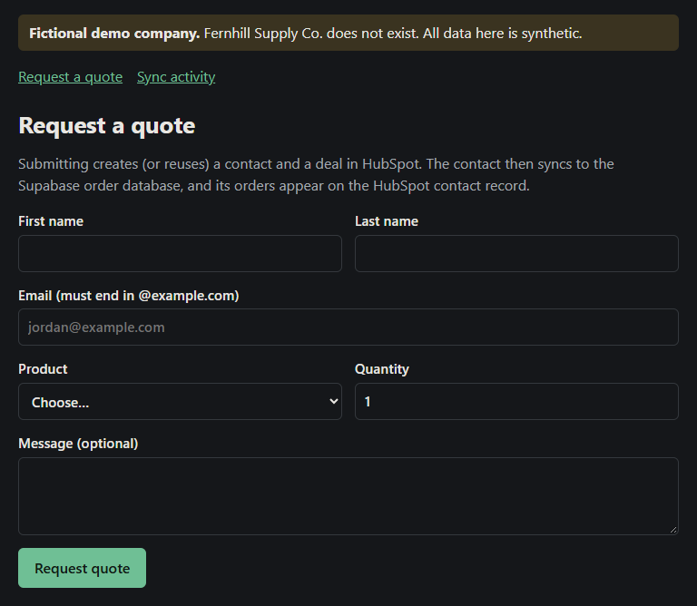
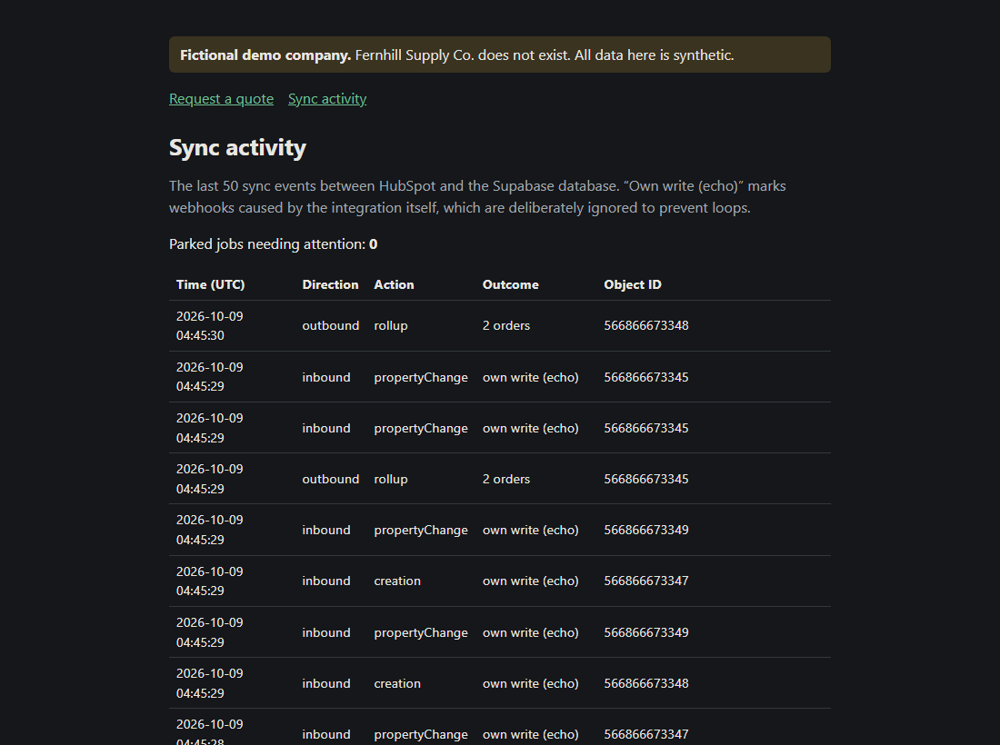

# 1. Overview

**Fernhill Order Sync** connects HubSpot CRM to a company's own order database and website, so the sales team sees
order history inside HubSpot, and contact changes made in HubSpot reach the database automatically.

> **Demo notice.** Fernhill Supply Co. is a fictional company. The live system holds only synthetic data
> (generated names, `@example.com` email addresses, seeded orders) and refuses to store anything else.

## What it does

| Capability | What the user sees |
|---|---|
| **Orders inside HubSpot** | An *Orders* card on every contact record lists that contact's orders from the database, newest first. |
| **Order totals on the contact** | Each contact shows total orders, lifetime value and last order date, kept up to date automatically. |
| **HubSpot → database** | Editing a contact's name, email, phone or lifecycle stage in HubSpot updates the database within seconds. |
| **Website → HubSpot** | A public quote form creates (or reuses) the HubSpot contact and creates a deal for the request. Submitting twice never creates duplicates. |
| **Visible operations** | A public activity page lists every sync event, with no personal data, and counts any jobs that need attention. |

## Business value

- **One view of the customer.** Sales and support see orders without logging into another system.
- **No double entry.** Contact details are maintained once, in HubSpot; the database follows.
- **Reliable by design.** Every change is queued, retried automatically, and checked again by a daily job. Nothing
  loops and nothing is duplicated. This was verified on the live system on 9 October 2026 (see [Testing and QA](06-TESTING-AND-QA.md)).
- **Low running cost.** The demo runs entirely on free tiers (HubSpot free CRM, Supabase Free, Vercel Hobby). For
  production use with real customers, see [Limitations and next steps](07-LIMITATIONS-AND-NEXT-STEPS.md).

## Live links

- Quote form: <https://fernhill-order-sync.vercel.app>
- Sync activity: <https://fernhill-order-sync.vercel.app/activity>
- Demo video (90 seconds): `Fernhill-Order-Sync-Demo.mp4`, included in this delivery
- Source code: `source/fernhill-order-sync-source.zip`, included in this delivery

## Screenshots

*The Orders card on a HubSpot contact record.*

*The public quote form.*

*The sync activity page, captured on 9 October 2026, showing a demo reset.*
