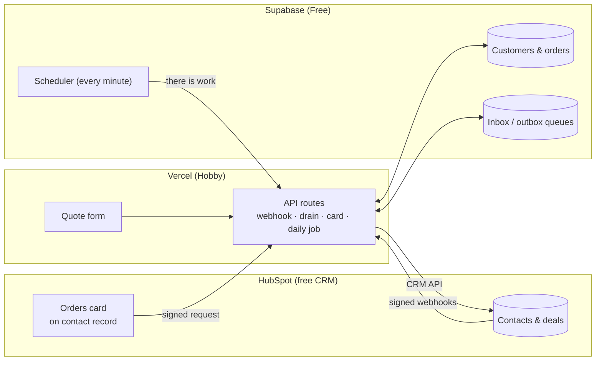

# 2. Architecture

This section explains how the system works in plain language. A short technical appendix follows for developers;
the full design is in the source code at `docs/ARCHITECTURE.md`, and the requirements at `docs/PRD.md`.

## The big picture

## The three components

| Component | Role | What lives there |
|---|---|---|
| **HubSpot app** "Fernhill Order Sync (demo)" | Connects to the CRM. Sends a notification (webhook) when a contact changes, and shows the **Orders** card on contact records. | App settings, webhook subscriptions, the card, three contact properties: *Demo: total orders*, *Demo: lifetime value*, *Demo: last order date* |
| **Vercel** (website and server) | Does all the work: receives HubSpot notifications, runs the sync, serves the quote form, the activity page and the card's data, and runs a daily check. | The Next.js web application and its configuration (environment variables) |
| **Supabase** (database) | Stores customers and orders, and two work queues. Signals Vercel every minute (and immediately on new work) when there is something to do. | Postgres database, scheduler (`pg_cron`), one secret in Supabase Vault |

The code for all three lives in one GitHub repository; every push runs automated tests and a secret scan.

## How data flows

### HubSpot → database (contact changes)

1. Someone edits a contact in HubSpot.
2. HubSpot sends a signed notification to Vercel. Vercel checks the signature, saves the notification in a queue and
   replies at once.
3. Vercel then asks HubSpot for the contact's **current** details and saves them in the database. It never trusts the
   notification's own copy, so late or out-of-order notifications cannot overwrite newer data.

Deleting a contact in HubSpot clears that customer's personal details in the database; their orders are kept.

### Database → HubSpot (orders)

1. An order is added, changed or removed in the database.
2. In the same database transaction, a job is queued to recalculate that customer's totals, and Vercel is signalled.
3. Vercel recalculates total orders, lifetime value (cancelled orders excluded) and last order date, and updates the
   three properties on the HubSpot contact.

A customer created directly in the database is linked to the HubSpot contact with the same email, or a new contact is
created for them.

### Website → HubSpot (quote form)

The form finds or creates the contact by email and creates a deal linked to it. It records each finished step, so a
retry after a failure continues where it stopped.

## Why it is safe and reliable

**No sync loops.** A loop happens when a change made by the integration comes back as a notification and is written
again. Three rules prevent this:

- **Each field has one owner.** HubSpot owns name, email, phone and lifecycle stage. The database owns orders and the
  three order totals. Only the owner's changes are synced.
- **The integration recognises its own writes.** When HubSpot reports a change made by this app, it is logged as
  "own write (echo)" and ignored.
- **The order totals are not watched.** HubSpot sends no notifications for the three order-total properties, so
  updating them can never trigger another sync.

**No duplicates (idempotency).** Every HubSpot notification has a unique key, and a notification received twice is
stored once and logged as "duplicate ignored". Order jobs for the same customer merge while they wait. Quote-form
submissions are recognised for 24 hours, so a reload or double click returns the first result.

**Self-healing.**

- A failed job is retried automatically after 1, 5, 30 and then 120 minutes.
- After 8 failed attempts, or an error that cannot succeed (such as a rejected request), the job is **parked**. Parked
  jobs are counted on the activity page for a person to review.
- A **daily job** re-checks every contact HubSpot changed in the last 48 hours and confirms every linked contact still
  exists, which catches anything a lost notification would have missed.

**Security.** Every request from HubSpot is signature-checked (requests older than 5 minutes are refused). Internal
endpoints need a secret. The database is closed to public access. Secrets live only in Vercel's encrypted settings,
Supabase Vault and a local file that is never committed.

## Technical appendix

| Topic | Detail |
|---|---|
| Stack | Next.js 16 (Node 22) on Vercel; Postgres 17 on Supabase with `pg_cron`, `pg_net`, Vault; HubSpot developer platform 2026.09 project with a static-token private app, an app card (React) and webhooks v3 |
| Endpoints | `POST /api/hubspot/webhook` (HubSpot v3 signature), `GET /api/card/orders` (signed `hubspot.fetch`, portal ID checked), `POST /api/drain` (bearer `DRAIN_SECRET`), `GET /api/cron/daily` (bearer `CRON_SECRET`, 06:00 UTC), `POST /api/form` |
| Webhook subscriptions | Contact creation, deletion, privacy deletion, merge, restore; property changes for `firstname`, `lastname`, `email`, `phone`, `lifecyclestage`; HubSpot concurrency capped at 2 |
| Queues | `sync_inbox` (one row per webhook event, unique `dedupe_key`) and `sync_outbox` (`rollup` and `link_contact`, one pending job per customer and kind). Rows are claimed with `FOR UPDATE SKIP LOCKED`; an abandoned claim is reclaimed after 5 minutes. |
| Echo rule | An event with `changeSource = INTEGRATION` and `sourceId = HUBSPOT_APP_ID` is skipped. This is safe because every write the app makes to a HubSpot-owned field is also written to the database in the same handler. |
| Ordering | Contact writes are guarded by HubSpot's `lastmodifieddate`, so an older state never overwrites a newer one. An identical newer state only advances the timestamp (`unchanged`). |
| Rate limits | HubSpot 429 responses are honoured using `Retry-After`. 5xx and network errors are retried 3 times in place, then handed back to the queue. |
| Data rules | Only `@example.com` contacts are stored (demo safeguard). Customers are soft-deleted, except by the demo reset. `sync_log` holds IDs and outcomes only. |
| Data model | `customers`, `orders`, `sync_inbox`, `sync_outbox`, `form_submissions`, `rate_limits`, `sync_log`. Row-level security is on with no policies, and public roles have no grants. |
